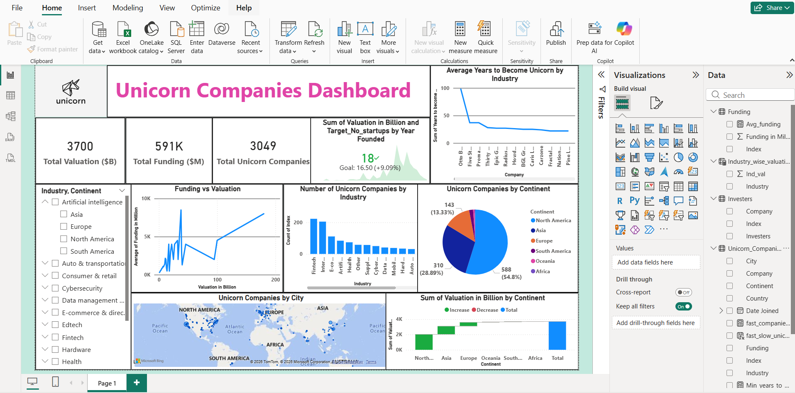

# unicorn-companies-powerbi-dashboard

## Project Overview
This project performs **Exploratory Data Analysis (EDA)** on Unicorn Companies using **Power BI**.

A **Unicorn Company** is a privately held startup company valued at **$1 billion or more**. These companies often grow rapidly due to innovation, strong funding, and technological advancements.

The objective of this project is to analyze unicorn companies based on **valuation, funding, industry trends, geographic distribution, and the time taken for companies to achieve unicorn status**.

An interactive **Power BI dashboard** was created to visualize insights and trends within the unicorn startup ecosystem.

---

## Problem Statement
Startups around the world are achieving unicorn status at an increasing rate. Understanding the factors behind their success can provide valuable insights into industry growth, investment patterns, and startup ecosystems.

This project aims to analyze:

- How startups achieve unicorn status
- Relationship between **funding and valuation**
- **Industry trends** among unicorn companies
- **Geographical distribution** of unicorn startups
- **Time taken for companies to become unicorns**

---

## Dataset Description

The dataset contains information about unicorn companies across various countries and industries.

| Field | Description |
|------|-------------|
| Company | Name of the company |
| Valuation | Company valuation in billions of dollars |
| Date Joined | Date when the company became a unicorn |
| Industry | Industry sector |
| City | City where the company is located |
| Country | Country where the company operates |
| Continent | Continent where the company operates |
| Year Founded | Year the company was founded |
| Funding | Total funding raised by the company |
| Select Investors | Major investors involved in the company |

---

## Project Workflow

The project follows a structured data analytics workflow:

1. Understanding the dataset  
2. Defining the problem statement  
3. Data cleaning and preparation  
4. Data modeling  
5. Data visualization  
6. Dashboard creation  
7. Insight generation  

---

## Data Processing Steps

### Data Ingestion
The dataset was imported into **Power BI** using the **Get Data** feature.

### Data Cleaning
Data cleaning was performed using **Power Query Editor**:

- Handling missing values
- Checking and correcting data types
- Preparing data for visualization

### Data Visualization
Several visualizations were created to analyze unicorn company trends, including:

- Industry analysis
- Geographic distribution
- Funding vs valuation analysis
- Continent-wise unicorn companies
- KPI summary cards
- Interactive filters (slicers)

### Dashboard Development
An interactive Power BI dashboard was developed to present insights in a clear and visually engaging way.

---

## Dashboard Features

The dashboard provides insights such as:

- Total Unicorn Companies
- Total Funding Raised
- Total Valuation
- Unicorn Companies by Industry
- Unicorn Companies by Continent
- Funding vs Valuation relationship
- Average Years to Become a Unicorn
- Geographic distribution of unicorn startups

---

## Tools and Technologies Used

- Power BI  
- Power Query  
- DAX (Data Analysis Expressions)  
- Data Visualization Techniques  

---

## Dashboard Preview

---

## Key Insights

- Technology-based industries dominate the unicorn ecosystem.
- North America and Asia have the highest number of unicorn companies.
- Higher funding often correlates with higher company valuation.
- Some startups achieve unicorn status very quickly due to rapid growth and innovation.

---

## Author

**Patri Chaitanya Sri Lalitha Sai**

Aspiring **Data Analyst** actively seeking **Entry-Level Data Analyst roles** where I can apply data analysis, visualization, and business intelligence skills to solve real-world problems.
